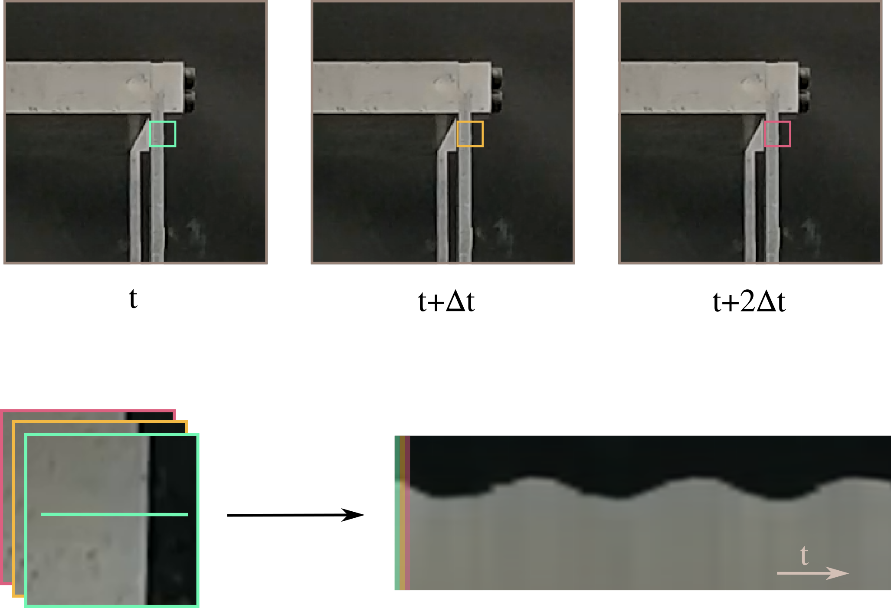

# Summary

Recent developments in computer vision have brought about a new set of techniques called Video Motion Magnification, which are capable of identifying and magnifying eye-imperceptible movements in video data. These techniques have proved effective in applications such as producing visual representations of an object’s operating deflection shapes or recovering sound from a room behind soundproof glass. Our research explores the new possibilities of motion magnification applied to Structural Health Monitoring (SHM) and vibration testing, harnessing the latest advances in deep-learning to achieve state-of-the-art results.

Vision-based damage detection techniques can reduce sensor deployment costs while providing accurate, useful, and full-field readings of structural behavior. We present a new video processing approach that allows the treatment of video data to obtain vibrational signatures of complex structures. This approach enables the identification of very light structural damage in a controlled lab environment. The presented software is based on the use of state-of-the-art deep-learning video motion magnification techniques to offer an easy-to-use, effective, full-field tool for SHM at a fraction of the cost of contact-based techniques.

# Related work

This work is based on the method developed by @LADOROIGE2022112218 for vibration-based damage detection and on the Swin Transformer Based Video Motion Magnification (STB-VMM) method [@lado2022_STB-VMM], which improves on the previous motion magnification backend [@oh_learning-based_2018] in terms of image quality.

Other researchers have used similar techniques for vibration testing [@MOLINAVIEDMA2018245; @EITNER2021106995]. However, to the authors' knowledge, non have released a software tool to go along with their publications. ViMag offers a simple interface to replicate some of these experiments using state-of-the-art learning-based video motion magnification.

<!-- Motion magnification is a video processing technique that consists on the transformation of input frames to exaggerate motion. The goal of these algorithms is to amplify subtle motions in a video sequence, allowing the visualization of vibrations and deformations that would otherwise be invisible. -->

Video motion magnification was first developed by @liu_motion_2005 opening a new range of possibilities for research and video postprocessing, however, this first approach produced numerous visual artifacts on top of being computationally expensive. Further developments by @wu_eulerian_2012 introduced a novel Eulerian approach to magnification that produced much cleaner results with less computational cost, paving the way for newer and more refined algorithms that produced increasingly better results such as [wadhwa_riesz_2014], [@oh_learning-based_2018] or [@lado2022_STB-VMM].

{ width=90% }

# Statement of need

ViMag provides an easy-to-use graphical user interface aimed at extracting time-series signals of vibrating machinery and structure videos. This software enables the visualization of videos, selection of magnification area, and signal processing. Consequently, it facilitates and automates the technique developed by @LADOROIGE2022112218 and allows machine learning layman to obtain reliable results without having to apply a manual multistage image processing pipeline. Therefore, this software facilitates the use of a camera as a functional replacement for an accelerometer by employing STB-VMM as the motion magnification backend.

The intended use of ViMag is to support the assessment of mechanical systems' performance, such as machines or structures. Researchers and engineers should consider employing condition monitoring or SHM methodologies on the outcomes yielded by ViMag. Such techniques are defined as the set of analysis and assessment tools applied to autonomously determine the integrity and durability of engineering structures. These techniques are aimed at tracking the operational status, assessing the condition, and alerting to the changes in the geometric or material properties that can affect a structure's overall performance, safety, reliability, and operational life [@frangopol_effects_1987;@cosenza_damage_2000].

However, the use for ViMag might not be constrained to mechanical engineering exclusively, and some other interesting applications could also benefit from the software, such as medical applications [@10.1007/978-3-030-59716-0_34] or miscellaneous technical demos like recovering sound from video [@10.1145/2601097.2601119].

# Video processing workflow

\autoref{fig:pipeline} presents a graph depicting the process of converting a video sequence to a discrete signal. To begin the signal extraction process, the user is asked to select a linear region of interest, preferably on a high-contrast area of the frame. Then, the area surrounding the selected region of interest is magnified using STB-VMM throughout the target video sequence's length. The motion-magnified result is then converted into a single image that represents movement in the temporal domain, achieved by extracting the selected linear region in each of the frames and stacking them horizontally as shown in \autoref{fig:slice_gen}. Finally, an edge detection algorithm is run over the temporal slice to determine the discrete temporal signal and convert it into an array of values over time. From this point on, existing signal processing techniques, such as the Fourier transform, can be used to extract further information.

{ width=80% }

Motion magnification acts like a microscope for motion, magnifying tiny movements on video sequences to retrieve seemingly invisible or almost imperceptible movements. Consequently, motion magnification may allow the naked eye to see a structure’s operating deflection shapes as they happened in real operating conditions. The STB-VMM model consists of three main functional blocks that extract features from frames, manipulate those features and finally reconstruct the frames. Implemented in PyTorch [@NEURIPS2019_9015], STB-VMM borrows ideas from @ViT, @Vaswani2017AttentionIA, and @SWIN to improve the image quality offered by prior motion magnification methods at the cost of some performance. The lack of temporal filtering and the higher image quality offered by STB-VMM play an important role in applications that require precise magnification for vibration monitoring, as less-noisy images produce clearer signals that highlight abnormal behaviors sooner.

# Acknowledgements

The authors would like to gratefully acknowledge the support and funding of the Catalan Agency for Business
Competitiveness (ACCIÓ) through the project INNOTEC ISAPREF 2021. Additionally, the first author would like to
acknowledge a Doctoral Scholarship from IQS.

# References